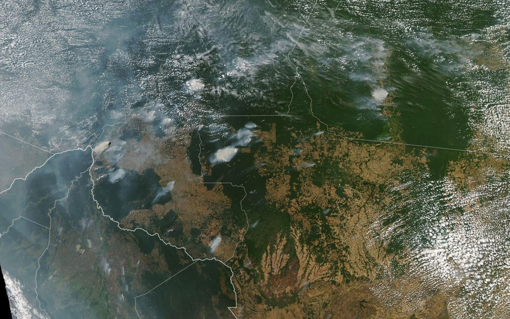
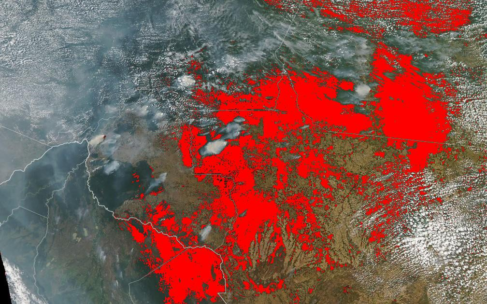

# Image analyzer

A simple image analyzer for counting and highlighting a color within an image

## How does it work?

1. You provide an image file
2. You select it's base color
3. The program prints the percentage of the selected color withing the given image
4. The program generates a new image with the base color highlighted

## Preview

- Source image

- Highlighted image

## Authors

|  |
| ----------------------------------------------------- |
| [Eder Lima](https://github.com/Nxrth-x)               |
